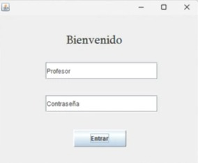
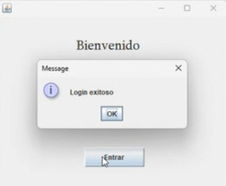
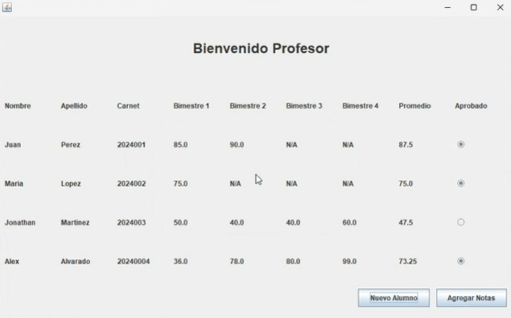
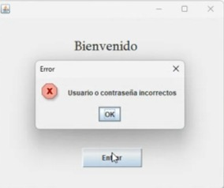
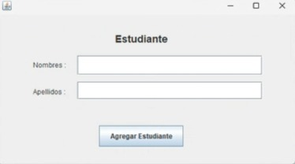
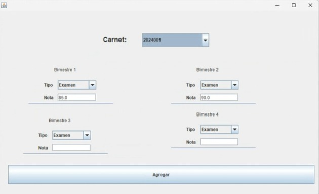

# Aplicación de Control de Notas para Primaria
## 1. Descripción del Proyecto

La aplicación tiene como objetivo gestionar el control de notas de estudiantes de un grado de primaria.
El sistema permitirá el registro de notas por bimestre, el cálculo de promedios y la determinación de si
un estudiante aprueba o no el año escolar. 

---

##  2. Características principales:

- Gestión de notas por bimestre (4 bimestres).
- Cada bimestre tiene una nota máxima de 100 puntos.
- Cálculo del promedio anual basado en las notas de los 4 bimestres.
- Determinación automática de si el estudiante aprueba el año escolar
---

## 3. Requisitos del Sistema

 - Lenguaje de Programación: Java 8 o superior
 - Dependencias Externas: Ninguna (proyecto independiente).
 - Windows 10 desde la versión Java 8
 
----

## 4.  Estructura del Proyecto
* El proyecto se organiza en las siguientes clases y paquetes:

  - 

- Paquete  Principal  
 Estudiante.java: Clase que representa a un alumno con sus datos personales (Nombre, Apellido, Carnet)
 
- Examen.java:Clase que representa la cantidad de puntos que optivo el alumno en la prueba (examen)

- Materia.java: representa las diferentes materias que impartiran diferentes o el mismo catedratico (maestro)
 
- Nota.java: representa la cantidad de puntos que optivo el alumno en las tareas.

- Persona. java: representa la clase padre, donde la heredan, Estudiante.java, Profesor.java, Tarea.java.

- Profesor.java: representa el nombre y contraseña de los catedraticos (Profesores) que utlizaran en la parte del login.

- Tarea.java: representa las tareas de los alumnos, donde tarea.java es una extension de Nota.java

    Paquete ui (Interfaz de Usuario)
  
 -  AgregarAlumnos.java: representa la interface para agregar nuevos alumnos 

- Login.java: representa cuando el usuario ingresara sus credenciales para poder ingresar al sistema

- Main.java: representa la pantalla donde se encuentran, el nombre de los alumnos, apellido, nota, carnet, aprobacion, semestre.

## 5. Funciones y Flujos del Sistema

- Login
Permite incresar las credenciales, que anteriormente el personal capacitado te brindo.
ingresa tu primer nombre y apellido e ingresa la contraseña designada por el personal capacitado.

- Agregar Alumno
 Permite registrar un nuevo alumno en un grado específico. Se solicitan datos básicos como nombre, apellidos, y asignación al grado.

- Ingreso de Notas por Bimestre
El sistema permite ingresar notas para cada uno de los cuatro bimestres, asegurándose de que cada nota esté en el rango de 0 a 100.

- Cálculo de Promedio Final
El promedio final de cada alumno se calcula tomando en cuenta las notas de los cuatro bimestres.

 - Determinación de Aprobación o Reprobación
el promedio final de un alumno es igual o mayor a 60 puntos, el alumno aprueba el año escolar. De lo contrario, lo reprueba

## 6. Casos de Uso
- 6.1 login de usuario
El  usuario podrá ingresar al sistema con las credenciales otorgadas. 
Donde debe escribir su "Nombre"  en la opción de  "nombre"
 La contraseña anteriormente otorgada en la opción "Contraseña" defaul 123

  - 

 si el inicio de secion es correcto tendra que mostras esta pantalla
 
 - 

   seguidamente le mostrara el siguente formulario
   
  - 

 - si usted ingresa erronaemente las credenciales les aparecera esta pantalla
Sistema de notas

- 

6.2 El usuario podrá registrar un nuevo alumno en al sección "registrar Alumno"
Ingrese el nombre y el apellido del nuevo alumno, el programa le hara automaticamente un carnet al alumno

- 

 - 6.3 para ingresar la nota del alumno

   seleccione el boton "Agregar notas", seguidamente se le desplegara una pantalla para poder agregar las notas
   podra seleccionar al alumno por carnet y al terminar seleccione el boton agregar
   
 - 

 ## 7. Posibles Mejoras
 
 - Reportes de notas y promedios exportables a formatos como PDF o Excel.
 - Sistema de autenticación para diferentes usuarios (profesores, administradores).

  ## 8. Contacto
  
   - Jonathan Martinez
   - jistupem1@miumg.edu.gt

   - Alex Alvarado
   - jalvaradom20@miumg.edu.gt

   - Mariela Aguilar
   - lixcoya1@miumg.edu.gt
  

